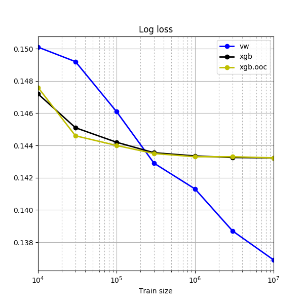
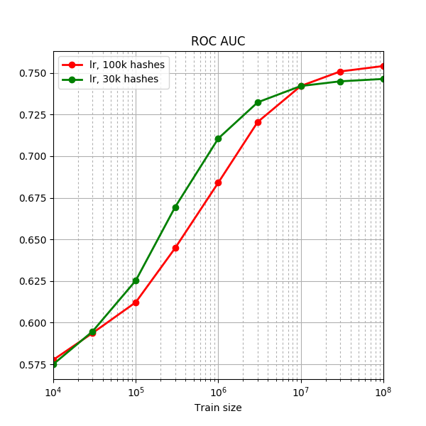
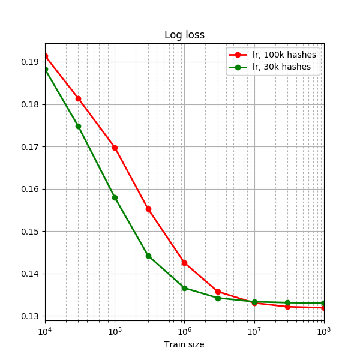
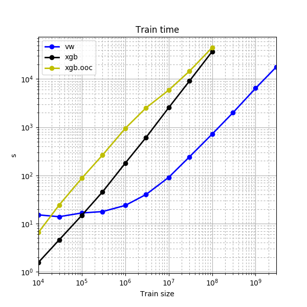
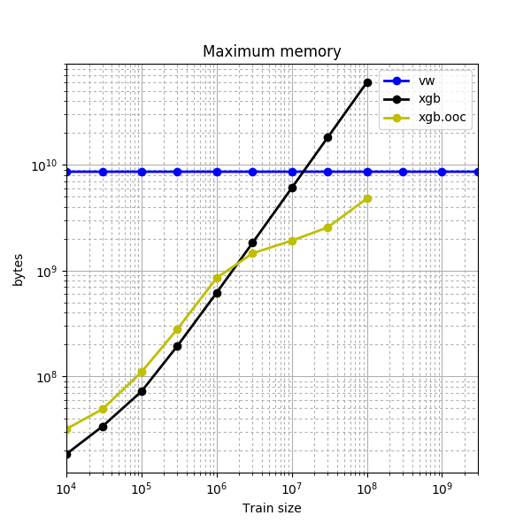
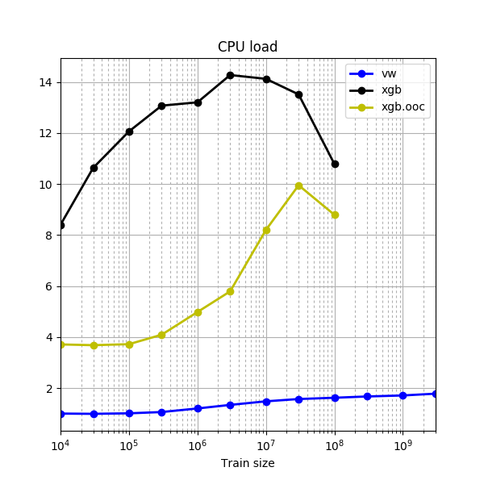
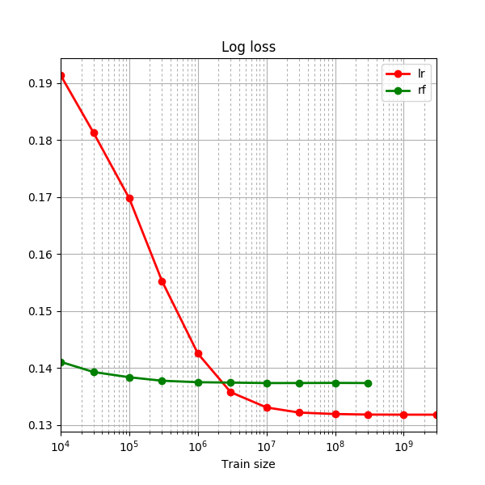

# Criteo 1 TiB benchmark

## Table of contents

* [Introduction](#introduction)
* [Task and data](#task-and-data)
* [Algorithms](#algorithms)
* [Setup](#setup)
* [Experiment layout](#experiment-layout)
  * [Parameter optimization](#parameter-optimization)
  * [Data format for Spark.ML](#data-format-for-sparkml)
  * [Code](#code)
* [Results](#results)
  * [Local training - Vowpal Wabbit & XGBoost](#local-training---vowpal-wabbit--xgboost)
  * [Distributed training - Spark.ML](#distributed-training---sparkml)
  * [Distributed training - Time vs. Cores](#distributed-training---time-vs-cores)
  * [Comparison of local and remote](#comparison-of-local-and-remote)
* [Conclusion](#conclusion)

## Introduction
[_(back to toc)_](#table-of-contents)

This project is a minimal benchmark of applicability of several implementations of machine learning algorithms to training on big data. Our main focus is [Spark.ML](http://spark.apache.org/mllib/) and how it compares to commonly used single-node machine learning tools Vowpal Wabbit and XGBoost in scaling to terabyte (billions of lines) train data. Quick web search shows that many people tested Spark but not on tasks requiring a cluster so they are mostly single-node tests.

This project is inspired by https://github.com/szilard/benchm-ml but targets building of models on billions of lines of train data, particularily models of Spark.ML in multinode cluster environment.

## Task and data
[_(back to toc)_](#table-of-contents)

Our target application is prediction of click-through ratio (CTR) of banners in online advertising. [Criteo released](http://labs.criteo.com/2015/03/criteo-releases-its-new-dataset/) an industry-standard open dataset that is ideal for this task - a dataset representing impressions of banners in online advertising during the timespan of 24 days. It is more than 1 terabyte in size and consists of more than 4 billion lines of data. Each line represents an impression of a banner and consists of 40 columns separated by tabulation (so-called TSV format):

- the first column is a label - {0, 1} - 1 meaning the banner was clicked and 0 otherwise;
- 13 numeric columns;
- 26 categorical columns with categories being 32-bit hashes.

This is how it looks like:

All the data except the last day was concatenated and sampled into training sets of  and  lines with  (i.e. train samples' sizes are 10k, 30k, 100k, ..., 1kkk, 3kkk lines). The last day was used for testing - a sample of one million lines was taken from it. All samples were converted to

- LibSVM format for training XGBoost models and as a source for the transformation to Spark.ML DataFrame;
- Vowpal Wabbit own data format.

Data for Spark.ML models was processed on-the-fly from LibSVM format:

- into a dataset of tuples of "label" (integer) and "features" (SparseVector of size  using hashing trick for all features) for Spark.ML LogisticRegression;
- into a dataset of tuples of "label" (integer) and "features" (SparseVector of 39 taken as-is from corresponding columns, see below) for Spark.ML RandomForestClassifier.

## Algorithms
[_(back to toc)_](#table-of-contents)

Historically, our team relies on heavy use of [Vowpal Wabbit](https://github.com/JohnLangford/vowpal_wabbit) and [XGBoost](https://github.com/dmlc/xgboost) exploiting "Local train + Distributed apply" scenario. We wanted to test how classification models of Spark.ML compare to them. We used:

- Vowpal Wabbit - it implements logistic regression with a hashing trick and reads the data only once never keeping more than one sample in memory (it is an out-of-core implementation);
- in-memory XGBoost - gradient-boosted trees implementation that (by default) loads the whole data into memory (which is faster than multiple reads from disk, but we are limited in size by machine memory);
- out-of-core XGBoost - a variant of XGBoost training which uses an on-disk cache; this is slower (compared to the in-memory variant) but potentially we can train on the data limited in size only by the size of HDD.

Our main concern about an out-of-core training of XGBoost was that it would not produce the same quality as an in-memory variant due to the approximate splitting algorithm.

From Spark.ML we chose the following models:

- [LogisticRegression](http://spark.apache.org/docs/latest/ml-classification-regression.html#logistic-regression),
- [RandomForestClassifier](http://spark.apache.org/docs/latest/ml-classification-regression.html#random-forest-classifier).

Our preliminary research shows that other four classification models from Spark.ML are not well-suited for our task of CTR prediction:

  

- [NaiveBayes](http://spark.apache.org/docs/latest/ml-classification-regression.html#naive-bayes) provides significantly worse logistic loss (which is an essential metric of CTR models' quality) than all other models;
- [DecisionTreeClassifier](http://spark.apache.org/docs/latest/ml-classification-regression.html#decision-tree-classifier) suffers in quality in comparison to the RandomForestClassifier but still requires roughly the same amount of time to train;
- [GBTClassifier](http://spark.apache.org/docs/latest/ml-classification-regression.html#gradient-boosted-tree-classifier) (Spark.ML implementation of gradient-boosted trees) and [MultilayerPerceptronClassifier](http://spark.apache.org/docs/latest/ml-classification-regression.html#multilayer-perceptron-classifier) do not support prediction of probabilities that are required by the task (these two models are not shown on graphs above).

## Setup
[_(back to toc)_](#table-of-contents)

Local models were trained on a 12-core (24-thread) machine with 128 GiB of memory. Distributed training was performed on our production cluster (total capacity is approximately 2000 cores and 10 TiB of memory); for the experiment a small part of resources had been allocated - 256 cores and 1 TiB of memory for training on datasets upto 300 million of lines and 512 cores and 2 TiB of memory for training on one billion and 3 billion lines of train data. 4 cores and 16 TiB of memory per Spark executor was used.

For the experiment we used Vowpal Wabbit 8.3.0, XGBoost 0.4 and Spark 2.1.0 running on a Hadoop 2.6 cluster (using YARN as a cluster manager).

## Experiment layout

### Parameter optimization
[_(back to toc)_](#table-of-contents)

Our first idea was to skip models' parameters optimization completely, but unfortunately XGBoost's default parameters are not good enough for training even on million lines of data - the default number of trees is only 10, and it hits the ceiling quite soon:

 

These pictures reminded us that production usage of any machine learning model is tied with optimization of its parameters, and in our experiment we should do the same. For optimization of parameters of models (including Spark.ML ones) we used million-line sample of train data and 5-fold cross validation for averaging the metric (log loss).

### Data format for Spark.ML
[_(back to toc)_](#table-of-contents)

We tried to do one-hot-encoding of categorical features, but due to very large numbers of unique values it turned out to be very time and memory consuming, so for Spark.ML we decided to try the hashing trick. Spark.ML LogisticRegression was trained using this approach. We sticked to hashing space of  hashes as it turned out to give about the same quality as VW on large samples. Taking less hashes usually leads to better quality on smaller data (because of less overfitting) and worse quality on bigger data (because some patterns in data are consumed by collisions in hashing space):

 

RandomForestClassifier was very slow to train even with a thousand hashes, so we used "as-is" format for it:

- all numeric features were converted to elements of SparseVector as-is;
- all categorical features were converted to elements of SparseVector by interpreting the hashes as 32 bit numbers.

### Code
[_(back to toc)_](#table-of-contents)

All work was performed in Jupyter notebooks in Python. Notebooks:

- [experiment_local.ipynb](notebooks/experiment_local.ipynb) was used for preparing the data and training of the local models;
- [experiment_spark_lr.ipynb](notebooks/experiment_spark_lr.ipynb) and [experiment_spark_rf.ipynb](notebooks/experiment_spark_rf.ipynb) for training Spark.ML LogisticRegression and RandomForestClassifier accordingly.

## Results

### Local training - Vowpal Wabbit & XGBoost
[_(back to toc)_](#table-of-contents)

    

Some observations:

- in-memory XGBoost and out-of-core XGBoost provide about the same level of quality, but out-of-core variant is about an order of magnitude slower;
- in-memory XGBoost is about an order of magnitude slower than Vowpal Wabbit on the same amount of train data;
- Vowpal Wabbit was able to give about the same quality as XGBoost trained on an order of magnitude smaller sample.

### Distributed training - Spark.ML
[_(back to toc)_](#table-of-contents)

  

We made the following conclusions:

- RandomForestClassifier is quite slow, and it is even slower when the data consists of large vectors;
- LogisticRegression is hard to cook for smaller samples and for bigger samples at the same time - either it overfits on small data or it cannot extract patterns due to more aggressive hashing trick.

### Distributed training - Time vs. Cores
[_(back to toc)_](#table-of-contents)

To check how model training scales to multi-core setup we made a quick test where we increased a number of cores and measured training time for every step. To make it fast we used a  sample of train data and checked training time for a number of cores from 5 to 50 in steps of 5. In order to eliminate the uncertainty brought forth by running the test in parallel with production tasks, for this test we created a standalone Spark cluster running on three machines with a total of ≈50 cores and ≈200 GiB of memory.

Training time dropped quite fast when we went from 5 to 15 cores but slowed down afterwards and completely ceased to improve by the mark of 40 cores (even growing a little for transition from 40 to 45 cores). The main idea that we extracted from this picture is that one should not increase amount of resources beyond minimum required, so that work distribution and aggregation overhead would be cheaper than potential improvement of speed by parallelization.

### Comparison of local and remote
[_(back to toc)_](#table-of-contents)

  

We can see that:

- on large datasets (100 million of lines and more) Spark.ML is faster than both Vowpal Wabbit and XGBoost; maybe it is possible to make it even faster by finding the best cluster setup for each size of training sample (we had not done this work);
- however it is slow when working with large vectors - steps should be taken in order to find a balance between quality and speed;
- for small tasks Spark introduces overhead that can be more expensive than it is possible to win by computing the task in parallel (well, this is true for parallel computing in general).

## Conclusion
[_(back to toc)_](#table-of-contents)

One should pick a correct tool for the task, and Spark.ML can be that kind of tool for training machine learning models on big data.
